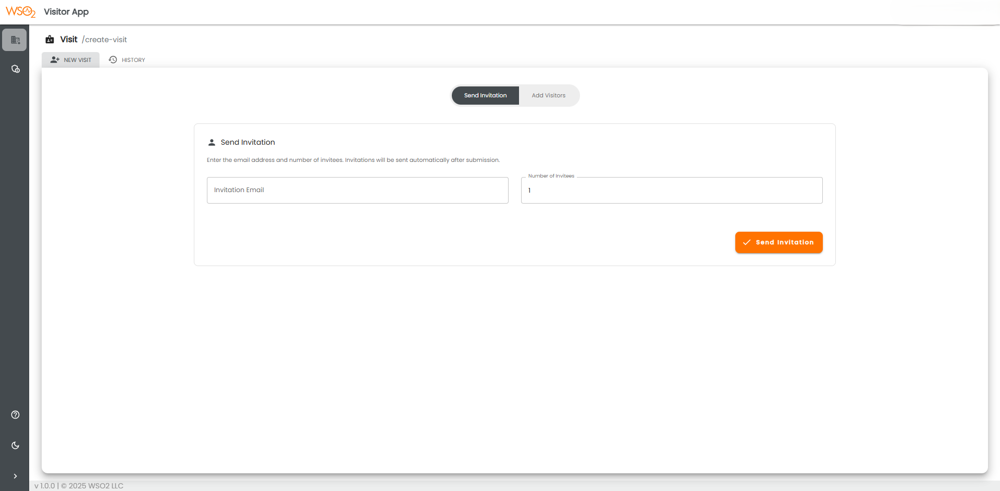
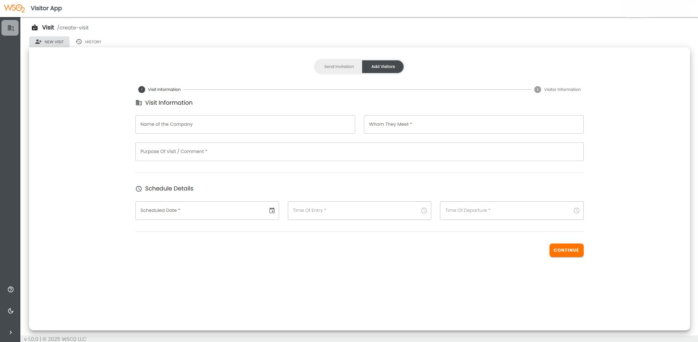
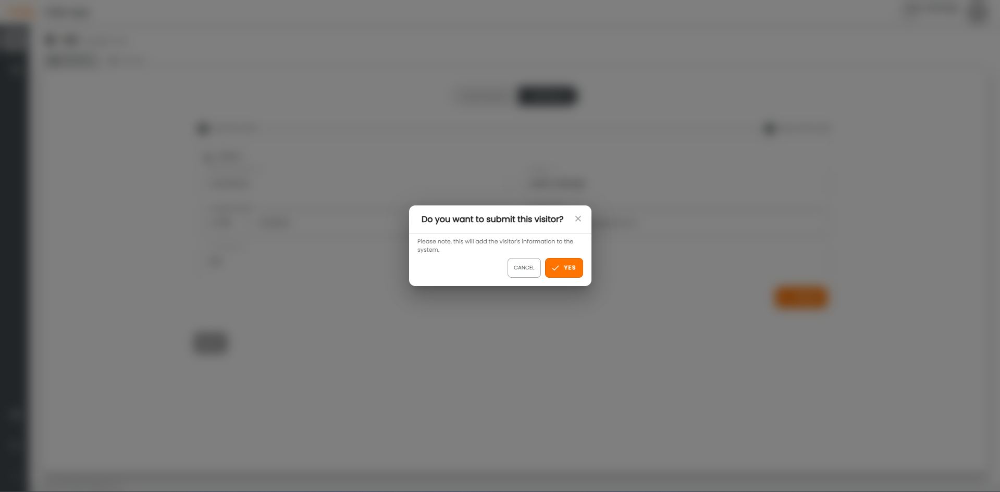
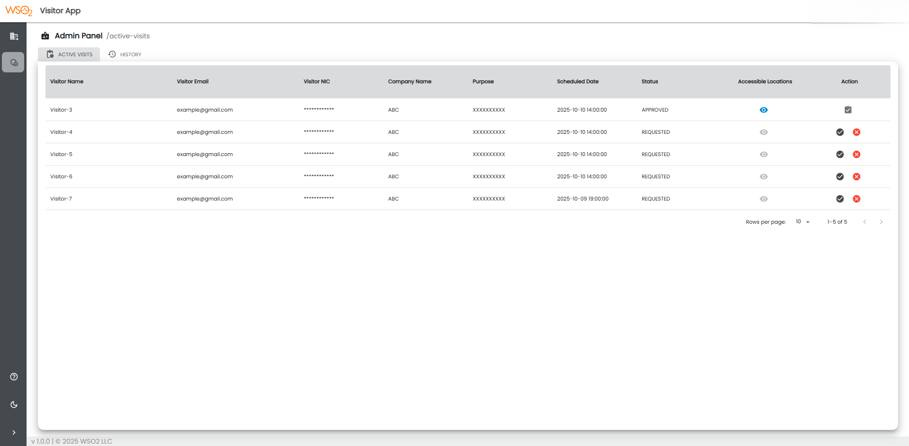
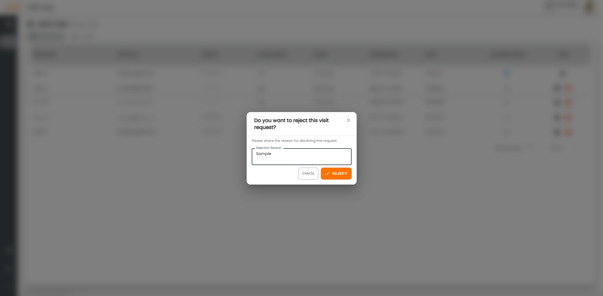
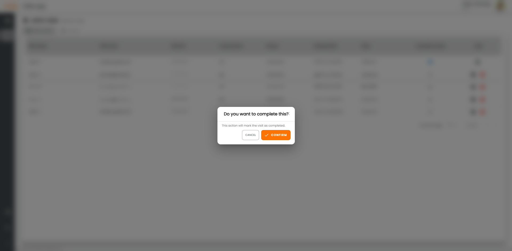
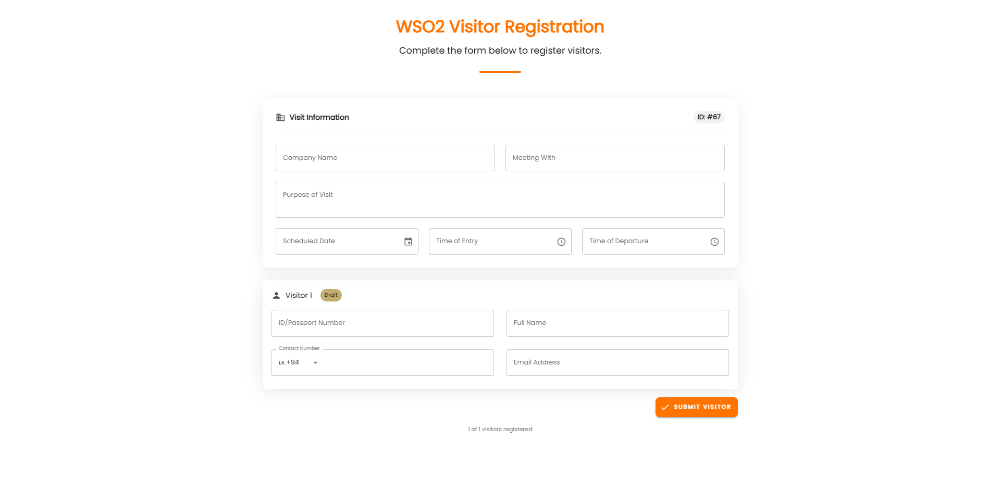

# **
WSO2 Visitor App User Guide
**

 

## **Objective**

To enhance visitor management at WSO2 premises by centralizing visit scheduling, invitations, approvals, and tracking within a single application.

The **WSO2 Visitor App** ensures secure access control, smooth coordination between hosts and visitors, and improved administrative oversight. Using the app, hosts can create visits or send invitations, while admins can approve, reject, and track visits efficiently.

 

## **WSO2 Visitor App Overview**

The **WSO2 Visitor App** is a application under the **WSO2 People Ops Suite** (an open-source project) developed by the WSO2 Internal Apps Team. It addresses visitor management requirements by enabling direct visit creation, invitation sending, approval workflows, and visit history tracking.

<em>Example: WSO2 Visitor App Interface</em>

 

## **Creating a Visit**

The app offers two main options for initiating a visit: **Send Invitation** (a quick way to invite visitors via email) and **Create Visit Directly** (a detailed form for scheduling and registering visits immediately).

Click the **New Visit** tab at the top and select your preferred option.

### **Option 1: Send Invitation**

1. Enter the **Invitation Email**.
2. Enter the **Number of Invitees**.

<em>Example: Send Invitation Form</em>

3. Click **Send Invitation**. The visitor will receive an email with details to confirm or complete their registration.

 

### **Option 2: Create Visit Directly**

1. Enter **Visitor Information** (name, company, purpose of visit, accessible floors, and schedule details).
2. Fill in all visit details and click **Continue**.

<em>Example: Visit Details Form</em>

3. Fill in the visitor details — **NIC/Passport Number**, **Full Name**, **Contact Number**, and **Email** (optional).
4. Click the **Submit** button.
5. Confirm your submission by clicking the **Confirm** button in the confirmation pop-up.

<em>Example: Visit Submission Confirmation</em>

 

## **Approving or Rejecting Visits**

Admins can manage pending visits from the **Admin Panel** tab.

1. View the list of visits in the table, which includes columns such as **Visitor Name**, **Visitor Email**, **NIC/Passport**, **Company Name**, **Purpose**, **Scheduled Date**, **Status**, and **Actions**.

<em>Example: Admin Panel Visit Table</em>

2. For each visit, use **Actions** menu to:

- **Approve Visit** – Confirms the visit and sends notifications to the host and visitor.
- **Reject Visit** – Requires a reason in the pop-up (e.g., “Do you want to reject this visit? Reason”) and notifies the visitor.
- **Complete Visit** – Marks the visit as finished with a confirmation pop-up (e.g., “Do you want to complete this visit?”).

<em>Example: Approve Visit</em>

<em>Example: Reject Visit</em>

<em>Example: Complete Visit</em>

 

## **Visitor Invitation (Self-Registration)**

Visitors can use the public-facing **WSO2 Visitor Registration Portal** to register themselves.

1. Enter **Visitor Information** (name, company, purpose of visit).
2. Specify the **Scheduled Date** and **Time of Entry**.
3. Enter the **Passport Number** and **Contact Details** (phone, email).

<em>Example: Visitor Self-Registration Form</em>

4. Click **Submit Visitor**. This creates a pending visit for approval by the WSO2 admin team.
    
   (This invitation will remain active until the user registers all the visitors defined in the invitation.)

 

## **Support & Assistance**

For any inquiries or support needs, please contact the **Internal Apps Team** at  
📧 [internal-apps-team@wso2.com](mailto:internal-apps-team@wso2.com)

---

**Last Updated:** October 2025  
**Maintained by:** WSO2 Internal Apps Team
